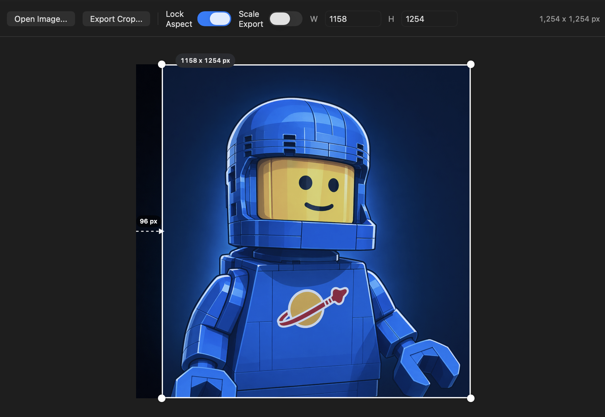
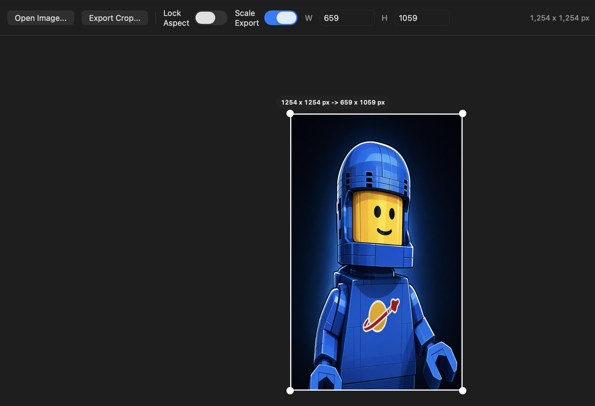
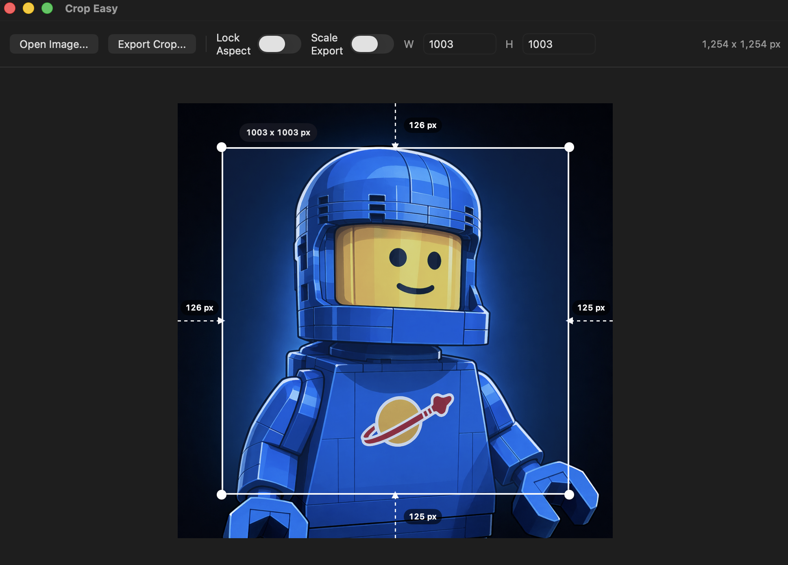

# Crop Easy

Crop Easy is a fast native macOS app for cropping images with exact pixel control.

It is built for simple everyday use: open or drop in an image, drag a crop box, see the live pixel size, type exact dimensions when needed, and export the result.

This started as a small quality-of-life side project for quickly doing precise image crops without opening a heavier image editor.

## Features

- Opens PNG, JPG/JPEG, WebP, TIFF, GIF, BMP, and other standard macOS image formats
- Supports drag-and-drop image opening from Finder
- Lets you drag to create, move, and resize a crop box
- Shows the selected crop size live in pixels
- Shows live edge margins so you can compare how many pixels were removed from the left, right, top, and bottom
- Lets you type exact width and height values
- Can lock or unlock the current aspect ratio
- Can optionally scale the selected crop into a typed export size
- Exports cropped images as PNG or JPEG
- Suggests export filenames that include the crop size, such as `photo-500x300_png.png`
- Includes a custom app icon

## Requirements

For normal use:

- macOS 14 or newer

For building from source:

- macOS 14 or newer
- Swift 6 toolchain or Xcode command line tools

You do not need a full Xcode project to build this app. It is a Swift Package executable.

## Use The App

1. Open Crop Easy.
2. Click `Open Image...`, press `Cmd+O`, or drag an image file onto the window.
3. Drag on the image to create a crop selection.
4. Drag inside the selection to move it.
5. Drag a corner handle to resize it.
6. Watch the center label for the crop size.
7. Watch the dashed side guides to compare how many pixels are being removed from each edge.
8. Type exact values into `W` and `H` if needed.
9. Press Return or click out of the field to apply typed dimensions.
10. Turn `Scale Export` on if you want the full image scaled into the selected output box.
11. Turn `Lock Aspect` on if you want to keep the current shape while resizing.
12. Click `Export Crop...` or press `Cmd+E`.

## Aspect Ratio In Plain English

Aspect ratio means the shape of the crop box.

- `1:1` is a square
- `16:9` is widescreen
- `4:5` is common for portrait social posts

When `Lock Aspect` is on, changing width also changes height so the shape stays the same.
When it is off, width and height can change independently.

## Scaling Exports

By default, `W` and `H` change the crop selection in source-image pixels. If you turn `Scale Export` on, the selection becomes an output canvas, and Crop Easy scales the full image into that canvas when saving.

For example, open a 1000 x 1000 image, turn `Scale Export` on, enter `128` by `128`, and export to create a 128 x 128 scaled image.

## Examples

### Precise Crop With Aspect Lock



### Scale An Image Into A New Size



### Normal Centered Crop



## Run From Source

From this project folder, run:

```bash
swift run
```

The app opens as a normal macOS window. The Terminal stays busy while the app is open. Quit the app to return to the shell prompt.

## Build A Clickable App

To create a clickable `.app` bundle, run:

```bash
scripts/package-app.sh
```

This creates:

```text
dist/Crop Easy.app
```

To build it and copy it to your Desktop in one step, run:

```bash
scripts/package-app.sh --desktop
```

To build it and copy it to your user Applications folder, run:

```bash
scripts/package-app.sh --applications
```

Then double-click `Crop Easy.app` like any other Mac app.

This local app bundle is not signed or notarized. It is intended for personal/local use. If you share it with other Macs, macOS may show a security warning.

## Test Checklist

There is currently no automated test suite. Use this manual checklist before sharing a build:

1. Run `swift run` or open the packaged app.
2. Open a PNG image.
3. Drag a JPG or WebP image from Finder onto the app window.
4. Create a crop box by dragging on the image.
5. Move the crop box by dragging inside it.
6. Resize from each corner handle.
7. Confirm the crop size label updates live.
8. Confirm the side margin labels update live.
9. Type width and height values, then press Return or click away.
10. Turn `Lock Aspect` on and confirm resizing keeps the same shape.
11. Export as PNG and JPEG.
12. Turn `Scale Export` on, enter a smaller output size, and export.
13. Open the exported file in Preview and confirm the pixel dimensions match the crop label or scaled export size.

## Keyboard Shortcuts

- `Cmd+O` opens an image
- `Cmd+E` exports the crop
- `Cmd+L` locks or unlocks the aspect ratio

## Technical Notes

- Built with SwiftUI and AppKit
- Uses Swift Package Manager instead of an Xcode project file
- Stores crop coordinates in source-image pixel space for accurate export
- Generates the app icon from `Assets/AppIcon.png` during packaging
- Build output lives in `.build/`
- Packaged app output lives in `dist/`
- `.build/` and `dist/` are intentionally ignored by Git

## License

Crop Easy is released under the MIT License. See `LICENSE` for details.
